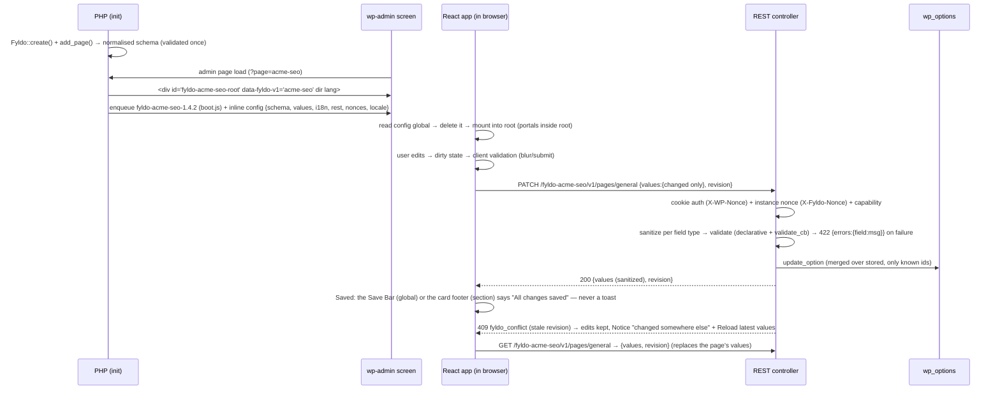

# Fyldo — Architecture

Status: **Phase 0 approved 2026-09-29 (with the changes recorded in §15). Milestone 1 complete (2026-09-29: the Figma token fixes are applied and the snapshot refreshed — see docs/figma-token-fixes.md). M2 complete; M3 complete (part 1: shell and navigation; part 2: save patterns, unsaved-changes guard, optimistic concurrency, brand). M4 complete (feedback: Toast, Tooltip, Icon Button, Notice with Action and Dismiss, Empty State, Modal Danger, the Danger card's reset action, `Instance::admin_notice()`).**
Companion docs: [design-spec.md](./design-spec.md) (what the design says) · [component-map.md](./component-map.md) (how each component is built).

**Verified during phase 0** (so these are facts, not assumptions):

| Fact | How verified |
|---|---|
| React shipped by WordPress: **6.5 = 18.2.0**, 6.6–6.9 = **18.3.1**, 7.0 and 7.1 = **18.3.1** | `package.json` at each `wordpress-develop` tag |
| Latest WordPress is 7.1.2, min PHP still 7.4 | `api.wordpress.org` version-check |
| Base UI is **`@base-ui/react` 1.8.0**, peers `react|react-dom ^17 \|\| ^18 \|\| ^19`; parts exist for every component we need incl. `toast`, `combobox` (chips), `alert-dialog`, `field`, `fieldset`, `direction-provider`, `csp-provider` | npm registry |
| shadcn has a **Base UI flavour** (`registry/base-nova/ui/*.tsx`) with `button, input, textarea, switch, checkbox, radio-group, select, combobox, tooltip, toast, empty, field, tabs, alert, alert-dialog, card, badge, spinner, separator` | shadcn registry JSON |
| Iconsax: `iconsax-react` last published **2021-12** (0.0.8); fork **`iconsax-reactjs`** 0.0.8 published **2025-04**, `sideEffects:false`, **995 one-file-per-icon ESM modules, 7.0 MB raw, each file carries all 6 variants** | `npm pack` + inspection |
| **Strauss 0.30.0** re-prefixes a package that declares only `"autoload": {"files": [...]}`, rewrites `Fyldo\V1` → `Acme\Vendor\Fyldo\V1` in namespaces, `::class`, fully-qualified refs **and namespace strings**, copies non-PHP assets (`assets/dist`), but does **not** touch global functions, global constants or hook-name strings | ran the PHAR against a fixture package (scratchpad) |
| Toolchain: Vite 8.3, Tailwind 4.3 (`@tailwindcss/vite`), Vitest 5, Playwright 1.63, `@wordpress/env` 11.16, `@wordpress/i18n` 6.29 (framework-agnostic, has `createI18n`) | npm registry |
| Local: PHP 8.4.7, Composer 2.8.9, Node 24.16, Docker 29 | shell |

---

## 1. Goals, constraints, support matrix

Fyldo is a settings-page framework: a developer **declares** pages → sections → fields in PHP; Fyldo **renders** a React admin UI and **validates + saves** through the REST API.

| Constraint | Decision |
|---|---|
| PHP | ≥ 7.4, tested 7.4–8.4. **Syntax ceiling 7.4**: no constructor promotion, `match`, enums, readonly, union types, named args, nullsafe. Enforced by `PHPCompatibilityWP` (`testVersion 7.4-`). |
| WordPress | ≥ 6.5. Tested on 6.5, latest stable (7.1), trunk. |
| Browsers | Last 2 evergreen versions (matches WP admin policy). Tailwind v4 raises the floor to **Chrome 111 / Safari 16.4 / Firefox 128** (cascade layers, `@property`, `color-mix`). |
| Node/npm | **Never required by consumers or end users.** Only by Fyldo contributors/CI. Every release artifact contains prebuilt assets. |
| Look | Vercel/Geist, **light mode only**, English (LTR default) + Persian (RTL). |
| Licence | GPL-2.0-or-later (required for wordpress.org and for bundling into GPL plugins). |
| Modes | (1) Standalone plugin (2) Drop-in folder (3) Composer package — **one codebase, one tree**. |
| Coexistence | Any number of copies, any versions, must not conflict. |

---

## 2. Repository layout

```
fyldo/                              ← repo root == the shipped tree (dev-only dirs are export-ignored)
├─ fyldo.php                        Entry point. Plugin header + tiny bootstrap (require Loader, register copy).
│                                   The SAME file is the plugin main file, the drop-in include, and the Composer `files` autoload.
├─ readme.txt / LICENSE / CHANGELOG.md
├─ composer.json                    autoload = { "files": ["fyldo.php"] } — deliberately NO psr-4 (see §6.4)
├─ src/                             PHP, namespace Fyldo\V1\…, PSR-4 layout, PHP 7.4 syntax
│  ├─ Bootstrap/Loader.php          Frozen contract: register(), boot(), on_ready(), loaded_version()   (§6.2)
│  ├─ Fyldo.php                     Public facade: create(), instance()
│  ├─ Instance.php                  One per slug: holds pages, menu, assets, REST
│  ├─ Schema/                       Page, Section, Field definitions, normalisation, registration-time validation
│  ├─ Fields/                       One class per type: TextField, ToggleField, SelectField … (sanitize + validate + to_client())
│  ├─ Storage/                      OptionStore (one wp_option per page), revision hashing
│  ├─ Rest/                         Controller, permission, nonce, error mapping
│  ├─ Admin/                        Menu registration, screen detection, root markup, PHP notices
│  ├─ Assets/                       Enqueue (per-instance handles), inline config, fonts, RTL/locale data
│  ├─ I18n/                         Text-domain loading for bundled copies, JSON locale for the UI
│  └─ Support/Naming.php            All slug/namespace-derived identifiers (§6.5)
├─ app/                             React + TS source (NOT shipped)
│  ├─ main.tsx  boot.ts             Mount, read+delete config global, i18n, isolation
│  ├─ components/ui/                shadcn/Base UI copies, restyled (Button, Input, Select …)
│  ├─ components/fyldo/             SettingRow, SectionCard, SaveBar, Sidebar, PageHeader …
│  ├─ fields/                       Field renderers by `type`, client validation (mirrors PHP)
│  ├─ icons/                        Icon wrapper, generated name map, RTL_FLIP list, Spinner
│  ├─ lib/                          cn(), api client, router, dirty-state store, portal context
│  └─ styles/                       app.css (Tailwind entry), tokens.generated.css, scoped-reset.css, fonts.css
├─ tokens/                          figma.tokens.json (DTCG snapshot, committed), figma.styles.json (text + effect styles)
├─ tools/                           tokens/build.ts · figma/extract-styles.js (run via MCP) · icons/build.ts · release/build.ts · fixtures/make-demos.ts
├─ assets/dist/                     BUILT: boot.js, app.js, chunks/, app.css, fonts.css, fonts/*.woff2, icons/  (gitignored on main; present in release tags)
├─ languages/                       fyldo.pot · fyldo-fa_IR.po/.mo · fyldo-fa_IR.json (UI strings, loaded by our own loader)
├─ tests/
│  ├─ php/        PHPUnit (unit + WP integration)         ├─ js/        Vitest + Testing Library
│  ├─ fixtures/   validation-cases.json (shared PHP+TS)   └─ visual/    Playwright screenshots + Figma reference PNGs
├─ e2e/                             Playwright specs · demo plugins (acme-alpha/beta/gamma/delta/omega) · hostile-css plugin
├─ docs/                            design-spec.md · component-map.md · ARCHITECTURE.md
├─ .wp-env.json · vite.config.ts · tsconfig.json · components.json · phpcs.xml · phpstan.neon · .gitattributes
```

`.gitattributes` `export-ignore`s `app/ tools/ tests/ e2e/ docs/ .github/ *.config.* node_modules` so `git archive`, GitHub zipballs and Packagist dists carry only the runtime tree.

---

## 3. PHP public API

**Principles.** Array-first (idiomatic WordPress, easy to generate/serialize/filter), strict registration-time validation with actionable `_doing_it_wrong` messages, no global functions or constants, PHP 7.4 syntax. A fluent builder can be layered later without breaking anything.

### 3.1 A realistic example (all three modes use the same code)

```php
<?php
/**
 * Plugin Name: Acme SEO
 * // Requires Plugins: fyldo      ← NOT available until Fyldo is approved on wordpress.org (M8); bundle it instead
 */

namespace Acme\Seo;

use Fyldo\V1\Fyldo;

// (a) Drop-in mode:        require_once __DIR__ . '/fyldo/fyldo.php';
// (b) Composer mode:       require_once __DIR__ . '/vendor/autoload.php';
// (c) Standalone plugin:   (not available until the wordpress.org approval, M8) — see §5

// Create instances on `init` (any mode). By then the highest 1.x copy has been selected (§6).
add_action( 'init', static function () {

	$fyldo = Fyldo::create( 'acme-seo', [                 // slug: [a-z0-9-]{3,40}, unique per site
		'title'      => __( 'Acme SEO', 'acme-seo' ),        // brand name (optional; default "Fyldo")
		'logo'       => 'chart-2',                          // brand logo: an Iconsax name (24px) or an image URL (24×24); default: the Fyldo mark
		'version'    => ACME_SEO_VERSION,                   // shown in the brand badge (optional)
		'capability' => 'manage_options',                   // default for every page/REST route
		'navigation' => 'sidebar',                          // 'sidebar' (default) | 'top'
		'menu'       => [
			'type'     => 'submenu',                        // 'submenu' | 'top'
			'parent'   => 'options-general.php',
			'title'    => __( 'Acme SEO', 'acme-seo' ),
			'position' => null,
		],
		'links'      => [                                   // utility links (sidebar footer / top-right)
			[ 'label' => __( 'Documentation', 'acme-seo' ), 'url' => 'https://acme.test/docs', 'icon' => 'book', 'external' => true ],
			[ 'label' => __( 'Help & support', 'acme-seo' ), 'url' => 'https://acme.test/help', 'icon' => 'message-question' ],
			[ 'label' => __( 'Changelog', 'acme-seo' ), 'url' => 'https://acme.test/changes', 'external' => true, 'placement' => 'header' ], // Page Header action
		],
	] );

	$fyldo->add_group( 'settings', __( 'Settings', 'acme-seo' ) );
	$fyldo->add_group( 'tools', __( 'Tools', 'acme-seo' ) );

	$fyldo->add_page( 'general', [
		'title'       => __( 'General', 'acme-seo' ),
		'description' => __( 'Manage your site’s identity, reading and privacy options.', 'acme-seo' ),
		'icon'        => 'setting-2',                       // ANY Iconsax name; unknown → nothing rendered + console.warn
		'group'       => 'settings',
		'save'        => 'global',                          // 'global' (Save Bar) | 'section' (card footers) — one per page
		'badge'       => 3,                                 // optional Nav Item badge (a count that needs attention)
		'tabs'        => [                                  // optional sub-pages at #/general/<tab>; never nested
			'identity' => __( 'Site identity', 'acme-seo' ),
			'reading'  => [ 'label' => __( 'Reading', 'acme-seo' ), 'icon' => 'book-1', 'badge' => 2 ],  // icon / count optional
		],
		'sections'    => [
			[
				'id'          => 'identity',
				'tab'         => 'identity',
				'title'       => __( 'Site identity', 'acme-seo' ),
				'description' => __( 'How your site appears to visitors and search engines.', 'acme-seo' ),
				'fields'      => [
					[
						'id'          => 'site_title',
						'type'        => 'text',
						'label'       => __( 'Site title', 'acme-seo' ),
						'description' => __( 'Shown in the browser tab and in search results.', 'acme-seo' ),
						'default'     => get_bloginfo( 'name' ),
						'placeholder' => __( 'My WordPress site', 'acme-seo' ),
						'validate'    => [ 'required' => true, 'max_length' => 60 ],  // declarative → runs in PHP AND in the browser
					],
					[
						'id'          => 'canonical_base',
						'type'        => 'url',
						'label'       => __( 'Canonical base URL', 'acme-seo' ),
						'validate'    => [ 'schemes' => [ 'https' ] ],
						// Server-only rule (never mirrored client-side; the server is authoritative):
						'validate_cb' => static function ( $value ) {
							return ( $value && ! wp_http_validate_url( $value ) ) ? __( 'This URL is not reachable.', 'acme-seo' ) : true;
						},
					],
					[
						'id'          => 'meta_description',
						'type'        => 'textarea',
						'label'       => __( 'Default meta description', 'acme-seo' ),
						'rows'        => 4,
						'validate'    => [ 'max_length' => 160 ],           // shows the live counter; over limit → Error (no truncation)
					],
					[
						'id'      => 'maintenance',
						'type'    => 'toggle',                              // renders inline in the row
						'label'   => __( 'Maintenance mode', 'acme-seo' ),
						'description' => __( 'Show a coming-soon page to visitors. Logged-in admins still see the site.', 'acme-seo' ),
						'default' => false,
					],
				],
			],
			[
				'id'     => 'reading',
				'tab'    => 'reading',
				'title'  => __( 'Language & indexing', 'acme-seo' ),
				'fields' => [
					[
						'id'      => 'language',
						'type'    => 'select',
						'label'   => __( 'Site language', 'acme-seo' ),
						'icon'    => 'global',
						'options' => [ 'en_US' => 'English (United States)', 'fa_IR' => 'فارسی', 'de_DE' => 'Deutsch' /* … */ ],
						'default' => 'en_US',
						'searchable' => true,                               // ≥ 6 options → searchable combobox
					],
					[
						'id'      => 'post_types',
						'type'    => 'multiselect',
						'label'   => __( 'Show on', 'acme-seo' ),
						'options' => static function () { return wp_list_pluck( get_post_types( [ 'public' => true ], 'objects' ), 'label', 'name' ); },
						'default' => [ 'post', 'page' ],
						'validate'=> [ 'min' => 1 ],
					],
					[
						'id'      => 'robots',
						'type'    => 'radio',                               // 2–5 visible choices; default REQUIRED
						'label'   => __( 'Search engine visibility', 'acme-seo' ),
						'options' => [ 'index' => __( 'Index', 'acme-seo' ), 'noindex' => __( 'Discourage indexing', 'acme-seo' ) ],
						'default' => 'index',
					],
				],
			],
			[
				'id'     => 'danger',
				'tone'   => 'danger',                                       // Danger Section Card (always last, always confirmed)
				'title'  => __( 'Reset settings', 'acme-seo' ),
				'description' => __( 'Restore every Acme SEO option to its default value.', 'acme-seo' ),
				'action' => [
					'id'      => 'reset',                                   // POST …/actions/reset (built-in: restore defaults)
					'label'   => __( 'Reset settings', 'acme-seo' ),
					'confirm' => [ 'title' => __( 'Reset all settings?', 'acme-seo' ), 'keyword' => 'RESET' ],
				],
			],
		],
	] );

	// Hooks are per-instance (slug in the name). See §6.5.
	add_action( 'fyldo/acme-seo/saved', static function ( $page, $new, $old ) { /* flush caches … */ }, 10, 3 );
} );

// Reading values anywhere (values are plain wp_options: `acme-seo_general`, autoload=no; the data belongs to the consuming plugin):
$title = Fyldo::instance( 'acme-seo' )->get( 'general', 'site_title' );     // sanitized, default-filled
$all   = Fyldo::instance( 'acme-seo' )->all( 'general' );
```

### 3.2 API surface (v1)

| Symbol | Contract |
|---|---|
| `Fyldo::create( string $slug, array $config ): Instance` | Registers one instance. Throws `_doing_it_wrong` and returns the existing one on duplicate slug. Validates config eagerly (unknown keys, types). |
| `Fyldo::instance( string $slug ): Instance` | Lookup. |
| `Instance::add_group / add_page` | Chainable. Registration-time validation: unique ids, radio has default, `options` non-empty, icon is a string, `save` is one of two values, danger section has `action`. |
| `Instance::get / all / update( $page, $values )` | Read (sanitized + defaults) / write programmatically (same sanitize+validate path as REST). |
| `Instance::admin_notice( $message, $args )` | *(M4)* A notice for the Fyldo screen, drawn under the Page Header by the app's own Notice component in **Fyldo's own slot** (`[data-slot=fy-notices]`, inside the root). It is **never** rendered with WordPress's `.notice` markup: core's admin JS moves every `.notice` under the first heading of `.wrap`, out of our screen. It travels in the client config (`notices`), so it needs no extra request. `$args`: `tone` (`gray` default \| `blue` \| `green` \| `amber` \| `red`, or WordPress's `info \| success \| warning \| error`), `title`, `dismissible` (default: `true` except for amber/red, which stay until resolved — design rule 6), `page` (a page id: only there; default every page), `id` (the same id/message is shown once), `action` (`label`, `url`, `external`: one Secondary Small link button). The message is plain text (no HTML). Shown most severe first; more than 3 at once is reported with `_doing_it_wrong` (design rule 6: a stack of 2–3). Call it before the screen's assets are enqueued (`init`, `admin_init`, `load-{screen}`). Dismissal lasts for the page visit: PHP queues the notice again on the next load, as it decides whether it still applies. |
| `Instance::reset( $page )` | *(M4)* Restores a page's defaults through the same path as the Danger card's `reset` action (below). |
| Danger section | *(M4)* `tone => 'danger'` needs `action => [ id => 'reset', label, confirm => [ title, description, keyword, label ] ]` and has **no fields** (it shows its header and one action); an ordinary section cannot have an `action`; only the built-in id `reset` exists (restore the page's defaults). All `confirm` texts are optional: an empty one is filled in by the browser with Fyldo's translated default (PHP runs before the text domain is guaranteed to be loaded). A `keyword` (≤ 40 characters) turns on the typed confirmation. All of it is validated at registration. |
| Field types (v1) | `text url email password number textarea code toggle checkbox checkbox_group radio select multiselect` (+ static `notice`). Later, after design: `repeater color media date`. |
| Declarative `validate` keys | `required min_length max_length pattern min max step schemes allowed min(for multi) max(for multi)`, plus the two the field type implies (`email`, `number`) — one JSON vocabulary evaluated by both PHP and TS, tested against one shared fixture file (§12). Evaluation order: `required, min_length, max_length, pattern, schemes, email, number, allowed, min, max, step`; the first failure wins. `step` counts from `min` (0 without one) with a float tolerance; malformed parameters (`step: 0`, `min > max`, an invalid `pattern`…) fail at registration. |
| Escape hatches | `sanitize_cb` (runs after the type's own sanitizer, before the rules), `validate_cb` (after the declarative rules pass; returns `true`, `false` or a message), both **PHP only** — a callable cannot run in the browser, so the server is where they are authoritative and their message arrives as the field's 422 error; `options` may be a callable, `disabled` may be `true` or a string reason (rendered in the description and part of the control's accessible description), `layout` override (`inline\|stacked`). |
| Registration-time `_doing_it_wrong` | one Primary button per card is a UI concern; the API enforces: one `save` mode per page, no nested tabs, Danger section last. |
| Brand (M3 part 2) | `title` (default "Fyldo", translated when shown; also the default admin-menu label) and `logo`: an Iconsax icon name (drawn with `<Icon>` at 24px) or an image URL (anything with `/` or `:`, passed through `esc_url_raw()`; drawn as a 24×24 ``, since the name beside it names the brand). Without a logo the Fyldo mark is drawn (design/figma/brand, inline SVG, `currentColor` = `text/primary`, `aria-hidden`). Brand row: logo · name · version Badge, gap 10. |
| Navigation (M3) | `navigation` `sidebar` (default) \| `top` per instance. Groups (`add_group`) label the Sidebar and become dividers in the Top Navigation; pages outside a group come first. `links[].placement`: `footer` (default: Sidebar footer / Top Navigation utilities) or `header` (Page Header actions; in the top layout they join the utilities). Page `badge` (string\|int). Tabs: `'id' => 'Label'` or `'id' => [ label, icon?, badge? ]`; tab ids are URL-safe like page ids. Each is validated at registration. |

### 3.3 Storage & naming defaults (part of the public contract)

- Option name: **`{slug}_{page}`** — literal, no transformation (`acme-seo` + `general` → `acme-seo_general`). Stored data belongs to the consuming plugin, so the name carries no `fyldo_` prefix. Page-level `'option_name' => 'acme_seo_general'` overrides it (e.g. to adopt an existing option). `autoload = false`. Value = **flat** associative array keyed by field id (sections are layout, not storage; moving a field between sections never loses data). Option names ≤ 191 chars → slug ≤ 40, page id ≤ 40.
- Values never include fields not in the schema; unknown keys are dropped on write.
- `password` fields are **write-only**: never sent to the browser; the UI shows a "•••• set" placeholder; omit/`null` = keep, `""` = clear. The browser's value for the field is `null` (one is stored, leave it) or `''` (none); typing replaces, emptying after typing clears. It is stored and returned by `Instance::get()` exactly as typed (never trimmed), `autocomplete` defaults to `new-password`, and it cannot have a `default`.
- `notice` fields are **display only**: not in `Page::fields()`, so never stored, never in `values`, never sent to or accepted from REST (an id in a payload is ignored like any unknown key). They accept only `label` (title, optional), `description` (the message, required) and `tone` (`gray|blue|green|amber|red`, default gray).
- `number` values are `int|float`, `''` when empty; Persian (۰-۹) and Arabic-Indic (٠-٩) digits are read as ASCII in the browser as the user types and again in PHP, the Persian decimal separator `٫` as `.` and the thousands separator `٬` is dropped; `url` and `email` do the same, `text` and `password` never do.

---

## 4. Data flow



Key rules:

1. **First paint needs no fetch**: schema and current (sanitized) values are in the inline config. The REST `GET` exists for refresh/conflict recovery.
2. **Partial `PATCH`** merges changed fields into the stored array; `revision` (hash of stored value) provides optimistic concurrency → `409 fyldo_conflict` (*built in M3 part 2*). The UI never overwrites the user's edits behind their back: the Save Bar (or the card footer) goes to Error with "Couldn’t save: these settings were changed somewhere else.", and an Amber Notice under the Page Header explains it ("They were saved in another tab or by another person after this page was opened…") with a Secondary Small **Reload latest values** (the pack's Notice action slot) that `GET`s the page and replaces its values and revision (unsaved edits on the page are dropped, as the notice says). Retrying Save without reloading asks the server again (it succeeds if the stored value is back to the revision the page knows).
3. **Server is authoritative.** Sanitize → validate; the client only mirrors declarative rules for instant feedback. Errors return `422` `{code:"fyldo_invalid", data:{status:422, errors:{<field>: "<message>"}}}`; the UI maps them onto fields and focuses the first invalid one.
4. **Security stack per request**: (a) WordPress cookie auth **`X-WP-Nonce` = `wp_rest`** (mandatory — without it core treats the user as logged out); (b) an **additional per-instance nonce** with action `fyldo_{slug}_rest` in `X-Fyldo-Nonce` (defence in depth + isolates instances); (c) `current_user_can( $page['capability'] ?? $instance['capability'] )` in `permission_callback` (never `__return_true`); (d) payload cap (default 512 KB), only known field ids, strict types; (e) no user-controlled option names.
5. **Save patterns** (design rule; *built in M3 part 2*): `global` → Save Bar, dirty tracking across the whole page, one PATCH with all changed fields; `section` → each card (with value fields; never a Danger card) has the pack's footer — status text (Copy/13; "Changes take effect after you save." when clean, then the Save Bar's texts; error text in `status/error/text`) + Primary Small **Save** (disabled while the card is clean) — and saves only its fields with its own PATCH; the two are mutually exclusive per page (validated at registration). Saves of one page run one at a time, each with the revision the previous one returned, so two cards saved back to back never conflict with each other. The forms live in an app-level store (`app/lib/page-form.ts`), not in the mounted page: values, revision and status survive tab AND page switches (a page saved, left and revisited keeps its new revision). A save keeps edits it did not carry (other cards, a field typed into while the request ran).
   - **Unsaved-changes guard** (*M3 part 2*): leaving a page with unsaved edits through Fyldo's navigation (nav items, the Menu disclosure) or Back/Forward/an edited hash opens the pack's Default **Modal** "Discard unsaved changes?" (Keep editing · Discard; focus starts on Keep editing; Esc/close/backdrop = Keep editing). For Back/Forward the URL is put back in place (`replaceState`) while it decides, and Discard shows the target in place (no extra history entry). Switching tabs never asks (tabs share the page's form). Leaving the screen (reload, another admin page, closing the tab) with any page dirty → `beforeunload`.
   - **Saved lifetime** (O15): "All changes saved" stays until the next edit of that scope or 4 s, then the Save Bar slides out (200 ms; it also slides in); no motion under `prefers-reduced-motion`. Ctrl/⌘+S inside a page with a Save Bar saves it.
6. **Danger actions** (*built in M4*) are `POST …/pages/{page}/actions/{id}` with the same `authorize()` as the page routes (cookie nonce → 401, instance nonce → 403, capability → 403, body cap → 413). Only an action the page's Danger section declares exists (404 otherwise), and the typed confirm keyword is checked **server-side** too — sent in the body as `keyword`, trimmed, case-sensitive, refused with `400 fyldo_confirmation` (the disabled button in the browser is not a security control). `reset` forgets the page's stored value (`delete_option`: every field reads its default again — including defaults that change later) and returns `{ values, revision }` like a save; a **disabled** field keeps what is stored (it cannot be changed from the UI, and a reset is a change). Hooks: `before_save` and `saved` fire with what is stored afterwards (an empty array when nothing is kept), then `fyldo/{slug}/reset( $page_id, $stored_before )`. In the browser the card's Error button opens the Danger Modal; on Confirm the page's form is replaced with the server's values (unsaved edits are dropped, as the confirmation says) and a Success toast says so; a failed request closes the modal and shows an Error toast with **Retry** (network / 5xx) or the server's message (e.g. an expired session).
7. **Multisite**: per-site options and `manage_options` by default; network-scope settings are a later, explicit `scope: network` (site options + `manage_network_options`).
8. **Uninstall**: Fyldo never deletes consumer data. `Instance::delete_data()` is provided for the consumer's own `uninstall.php`.

---

## 5. Distribution modes and release artifacts

All three modes ship **the same tree** (`fyldo.php`, `src/`, `assets/dist/`, `languages/`, `LICENSE`, `readme.txt`). Modes differ only in *who loads `fyldo.php`*.

| Mode | Who loads `fyldo.php` | Notes |
|---|---|---|
| 1. Standalone plugin | WordPress (plugin header) | The ZIP is built and tested from M1 (and takes part in version negotiation like any copy). The **`Requires Plugins: fyldo` dependency mode is documented as unavailable** until Fyldo is approved on wordpress.org (M8): WP only resolves dependencies for .org slugs. Slug check (2026-09-29): `fyldo` is free on wordpress.org; it cannot be reserved without a complete plugin, so the submission is planned for M8. |
| 2. Drop-in folder | Consumer: `require_once __DIR__ . '/fyldo/fyldo.php';` | The folder is the unzipped release. A plugin header inside a nested folder is ignored by WP (only top-level/one-deep plugin files are scanned). |
| 3. Composer | Composer `files` autoload | `composer require fyldo/fyldo`. `composer.json` intentionally declares **no PSR-4 map** (§6.4). Strauss-compatible (§7). |

### 5.1 How each artifact is built (`npm run release`, CI-only; consumers never run it)

```
1. tokens:check              regenerate CSS from tokens/figma.tokens.json, fail on drift
2. npm ci && npm run build   Vite → assets/dist/ (boot.js, app.js, chunks, app.css, fonts.css, fonts/, icons/)
3. npm run i18n              wp i18n make-pot → languages/fyldo.pot; compile fa_IR .po → .mo + JSON
4. composer install --no-dev (only to validate autoload/lint; nothing from vendor/ ships)
5. verify                    php -l on every file (7.4 … 8.4), phpcs, size budgets, bundle has no `window.` writes (§8.6)
6. assemble  build/fyldo/    git-archive of runtime tree (export-ignore applied) + overlay assets/dist + languages
7. artifacts
   ├─ fyldo-<ver>.zip            (plugin)  build/fyldo/  incl. readme.txt, wordpress.org assets excluded
   ├─ fyldo-dropin-<ver>.zip     (drop-in) same folder, readme.txt removed; unzips to fyldo/
   └─ Composer package           see below
```

**Composer with prebuilt assets.** Packagist serves `git archive` of a tag, which cannot contain untracked files. Chosen approach: the release workflow makes a **release commit** on top of the tagged source commit that force-adds `assets/dist` and `languages/*.mo|json`, and tags *that* commit (`v1.4.2`). `main` never contains build output. The tree of that tag is exactly what the ZIPs contain. (Alternative: a read-only mirror repo — see decision O9.) Verified by CI: `composer create-project` a fixture consumer from the tag, run the coexistence suite against it.

**Version source of truth.** One string in `fyldo.php` header (`Version:`) and `composer.json`; `tools/release/build.ts` asserts they match the git tag and that `Loader::register( '<version>' )` reads the same header (no duplicated literal — the entry file parses its own header via `get_file_data` once, cached).

---

## 6. Coexistence design

### 6.1 Verdict on the proposed layering — keep it, with six refinements

The layered strategy (major-versioned namespace → in-major version negotiation → optional Strauss → per-instance identifiers → asset isolation) is the right standard approach and is what Action Scheduler / CMB2 / Freemius converged on. I would change only these things:

1. **Registry = plain data + a frozen mini-Loader**, not the full library. Negotiation must work even when the *first-loaded copy is the oldest*; so the code that runs first must be tiny, dependency-free and never change within a major (§6.2). Contract tests against **every released 1.x tag** enforce this (§12).
2. **Skip ineligible copies.** Each copy registers `requires_php` / `requires_wp`; the Loader picks the highest *eligible* copy. A 1.6 needing PHP 8.0 on a PHP 7.4 site must not win over a 1.3 bundled by another plugin — otherwise one plugin's upgrade fatals the other. (Recommendation still: raise minimums only in majors — O8.)
3. **Composer must not own the autoload of `Fyldo\V1\*`.** A PSR-4 entry in `composer.json` would let Composer resolve classes from whichever `vendor/` was autoloaded first, silently defeating negotiation. So Composer only `files`-loads the entry file; **the winning copy registers its own autoloader, prepended** (§6.4). Verified: Strauss processes a `files`-only package correctly.
3b. **Derive hook/global names from `__NAMESPACE__`, never from literals.** My Strauss probe showed hook-name strings and global constants are *not* rewritten; two Strauss-prefixed copies would otherwise fire the same hook and cross-talk. Everything runtime-global is built from `Support\Naming` (namespace → `fyldo-v1` / `acme-vendor-fyldo-v1`).
4. **One Fyldo screen per admin page** is an explicit invariant (enforced at render). It makes static, shareable CSS/JS safe: the built CSS scopes on `[data-fyldo-v1]`; the instance slug is the attribute *value*, and every runtime identifier is slug-derived.
5. **No global functions, constants or `$GLOBALS` keys, ever** (also a Strauss requirement). Class constants and static properties only.
6. **A different major is a different world**: `V2` has its own Loader, registry, hooks, handles, CSS attribute (`data-fyldo-v2`), REST namespace version. Nothing is shared, so V1 and V2 need no negotiation and may be active together on the same request.

### 6.2 Version negotiation (per major) — the frozen `Loader` contract

```php
namespace Fyldo\V1\Bootstrap;

final class Loader {
	const CONTRACT = 1;                                   // bump ⇒ new major
	private static $copies = [];                          // realpath => ['version','path','requires_php','requires_wp']
	private static $winner = null;  private static $hooked = false;  private static $ready = [];

	public static function register( string $version, string $path, array $meta = [] ): void { /* add; hook boot once */ }
	public static function boot(): void                 { /* choose winner; register autoloader; run on_ready callbacks */ }
	public static function on_ready( callable $cb ): void {}   // runs immediately if already booted
	public static function loaded_version(): ?string {}        // for diagnostics / tests
	public static function loaded_path(): ?string {}
}
```

Rules:

- `fyldo.php` (identical in every copy):
  ```php
  namespace Fyldo\V1;
  defined( 'ABSPATH' ) || exit;
  if ( ! class_exists( Bootstrap\Loader::class, false ) ) { require_once __DIR__ . '/src/Bootstrap/Loader.php'; }
  Bootstrap\Loader::register( /* version parsed from this file's header */, __DIR__, [ 'requires_php' => '7.4', 'requires_wp' => '6.5' ] );
  ```
  `Loader::class` is a compile-time constant (no autoload, no string) ⇒ Strauss-safe. The **first copy loaded defines `Loader`**; every later copy just calls its `register()`. Hence the contract freeze: `register/boot/on_ready` signatures and semantics never change inside V1; new data goes in the `$meta` array (extensible, ignored by old Loaders).
- `register()` hooks `plugins_loaded` at **priority 0** once. All plugin main files have been included by then, so every copy is registered (mu-plugins, plugins, Composer autoload in consumers). Registering **after** `boot()` cannot change the winner: it logs a `_doing_it_wrong` in `WP_DEBUG` ("Fyldo 1.5.0 registered too late; 1.4.2 is active").
- `boot()`: filter out copies whose `requires_php`/`requires_wp` are unmet → sort by `version_compare()` descending (pre-releases sort below their release), tie → `strcmp( path )` (deterministic) → the winner registers an SPL autoloader for the `Fyldo\V1\` prefix → `<winner>/src/`, **prepended**, prefix taken from `__NAMESPACE__` → `require` nothing else → run `on_ready` callbacks. Then `Instance` code (from the winner) is used for **all** consumers of that major.
- Consumers create instances on `init` (works in all three modes because `init` > `plugins_loaded`). `Loader::on_ready()` is the escape hatch for code that needs Fyldo earlier.
- **Consequence = strict semver inside a major**: bundled copy 1.2 in plugin A will run on 1.5 loaded from plugin B. Anything A relied on must keep working. Deprecations live ≥ 1 minor + 6 months, removed only in the next major. Minimum PHP/WP raised only in majors (O8).

### 6.3 What is shared vs isolated

| Layer | Shared across plugins? | Isolation mechanism |
|---|---|---|
| PHP classes of one major | **Yes**, the winner's code runs for all | negotiation (§6.2); strict semver |
| PHP classes of different majors | No | namespace `Fyldo\V1` vs `Fyldo\V2` |
| PHP classes under Strauss | No | re-prefixed namespace (§7) — a private copy, no negotiation |
| Instance state (options, REST, hooks, nonces, handles, DOM ids) | **Never** | slug-derived identifiers (§6.5) |
| Built JS/CSS | Files are per-copy; only the winner's are served | handles include slug **and** version; one screen = one instance |
| Browser globals | None (§8.6) | ES module + IIFE-free boot; config global read-and-deleted |

### 6.4 Autoloading

- `composer.json`: `"autoload": { "files": ["fyldo.php"] }`, `"autoload-dev"` for tests only. **No `psr-4`.**
- The winner's autoloader is a 12-line closure: if the class starts with the derived prefix, map the remainder to `src/…​.php` and `require`. It is registered with `prepend = true`, so it wins over any Composer loader registered earlier.
- Contributors get IDE/PHPUnit PSR-4 via `autoload-dev` + `composer dump-autoload` locally; nothing in the shipped artifact depends on it.

### 6.5 Per-instance runtime identifiers (everything derives from the slug — nothing is literal)

Example: slug `acme-seo`, running Fyldo `1.4.2`, page `general`.

| What | Derived value | Source |
|---|---|---|
| Option name | `acme-seo_general` (`{slug}_{page}`, literal; override per page) | `Naming::option( $slug, $page )` |
| REST namespace | `fyldo-acme-seo/v1` (routes `/pages/(?P<page>…)`, `/pages/…/actions/(?P<action>…)`) | `Naming::rest_ns` |
| Script handle | `fyldo-acme-seo-1.4.2` (classic `boot.js`) | `Naming::handle( $slug, $ver )` |
| Style handles | `fyldo-acme-seo-1.4.2` (app.css), `fyldo-acme-seo-fonts-1.4.2` | same |
| Inline config variable | `window.__fyldo_acme_seo__` (written by `wp_add_inline_script( handle, …, 'before' )`; **read and `delete`d by the app on boot**) | `Naming::config_var` |
| Nonce actions | `wp_rest` (cookie auth, required) **+** `fyldo_acme-seo_rest` (per-instance) | `Naming::nonce_action` |
| Hooks (all include slug) | `fyldo/acme-seo/config` (filter) · `…/before_save` · `…/saved` · `…/reset` · `…/sanitize/{page}` · `…/validate/{page}` | `Naming::hook( $slug, $event )` |
| DOM root id | `fyldo-acme-seo-root` | `Naming::dom_id` |
| CSS root attribute | `data-fyldo-v1="acme-seo"` (attribute **name** per major is static because the CSS file is shared; the **value** is the slug) | built CSS scopes on `[data-fyldo-v1]` |
| Tailwind classes / CSS vars | `fy:` utility prefix, `--fyldo-*` custom properties (Figma's own code-syntax names) | build-time |
| Loader-level identifiers (registry, diagnostics hook) | `Naming::vendor_slug()` = `str_replace( '\\', '-', strtolower( namespace ) )` → `fyldo-v1` or `acme-vendor-fyldo-v1` | derived from `__NAMESPACE__` (Strauss-proof) |
| Text domain (Fyldo's own strings) | `fyldo` (loaded from the winner's `languages/`, not from wp.org) | `I18n\Loader` |

Slug rules: `^[a-z][a-z0-9-]{2,39}$`, unique per site. A second `create()` with the same slug **in the same namespace** is rejected (`_doing_it_wrong`, existing instance returned). Across different namespaces (a Strauss-prefixed copy, another major) Fyldo can only check what WordPress itself exposes — already-registered REST namespaces (`rest_get_server()->get_namespaces()`), admin menu slugs, and existing option names — and the later instance refuses to register on collision (reported via `_doing_it_wrong` under `WP_DEBUG`). Slug uniqueness is therefore a consumer responsibility, documented as "prefix your slug with your plugin's vendor name".

---

## 7. Strauss (optional full isolation) — exact configuration

Purpose: a consumer that wants **zero interaction** with any other Fyldo (no negotiation, its own version pinned) re-prefixes the package into its own namespace. The `extra.strauss` block below was run **verbatim** with Strauss **0.30.0** (PHAR) on a fixture package that declares only `files` autoload. The `scripts` and consumer `autoload` lines are standard Composer wiring that I could **not** exercise in phase 0 (Packagist was unreachable from the sandbox, so the fixture's `vendor/` was laid out by hand); the Composer smoke job in M6 covers them.

**Consumer's `composer.json`:**

```json
{
  "name": "acme/seo",
  "require": { "fyldo/fyldo": "^1.4" },
  "require-dev": { "brianhenryie/strauss": "^0.30" },
  "extra": {
    "strauss": {
      "target_directory": "vendor-prefixed",
      "namespace_prefix": "Acme\\Vendor\\",
      "classmap_prefix": "Acme_Vendor_",
      "constant_prefix": "ACME_VENDOR_",
      "packages": [ "fyldo/fyldo" ],
      "update_call_sites": false,
      "delete_vendor_packages": true,
      "exclude_from_prefix": { "file_patterns": [ "/^psr.*$/" ] }
    }
  },
  "scripts": {
    "prefix-namespaces": [
      "@php vendor/bin/strauss",
      "@composer dump-autoload"
    ],
    "post-install-cmd": [ "@prefix-namespaces" ],
    "post-update-cmd":  [ "@prefix-namespaces" ]
  },
  "autoload": { "classmap": [ "vendor-prefixed/" ] }
}
```

Result (verified): `Fyldo\V1\Fyldo` → `Acme\Vendor\Fyldo\V1\Fyldo`; `Bootstrap\Loader::class`, fully-qualified `\Fyldo\V1\…`, and the namespace string `'Fyldo\\V1\\Fyldo'` are all rewritten; `assets/dist/**` is copied; the `namespace` header of `fyldo.php` becomes `Acme\Vendor\Fyldo\V1`. The consumer then does:

```php
require_once __DIR__ . '/vendor-prefixed/autoload.php';       // or classmap via the consumer's vendor/autoload.php
use Acme\Vendor\Fyldo\V1\Fyldo;                                // same API, private namespace
```

Behaviour of a prefixed copy:

- It has its **own `Loader`, registry, hooks (`acme-vendor-fyldo-v1/…`), and never negotiates with unprefixed copies**; it wins its own (single-entry) negotiation.
- Its assets are served from the consumer's own plugin URL. Its CSS/JS are byte-identical to the upstream build (JS is namespace-agnostic), so it still uses `data-fyldo-v1` — safe because of the one-screen-one-instance invariant.
- Slug uniqueness across prefixed and unprefixed copies is still required (option names, REST namespace, admin menu slug live in shared WordPress tables).

**Code rules that keep Fyldo Strauss-safe** (enforced by a CI lint, `tools/lint/strauss-safe.ts`, plus a Strauss smoke build that loads the prefixed copy in wp-env):

| Rule | Why |
|---|---|
| No class names built from strings (`new $c`, `class_exists( 'Fyldo\V1\X' )`, `'\\Fyldo\\V1\\…'` in arrays) except via `X::class` or `__NAMESPACE__ . '\\'` | Strauss rewrites literal namespace strings, but dynamic composition and `str_replace` tricks are invisible to it |
| No hard-coded namespace in strings that are used **as data** (hook names, handles, option names, CSS attributes, REST namespaces) | Strauss *would* rewrite `'Fyldo\\V1'` in a string, but these identifiers are not namespaces; they must come from `Naming` |
| **No global functions, no `define()`/global constants, no `$GLOBALS`** | Strauss (0.30) leaves them unprefixed → redeclaration fatals between copies. Class constants/statics only |
| No `class_alias`, no reflection on class names | rename-unsafe |
| Templates/PHP files loaded by relative path only (`__DIR__`), never by class-derived path | prefixed copies live in a different directory |
| Every file `namespace`d; no procedural files besides `fyldo.php` (which is `namespace`d too) | Strauss only rewrites namespaced/class symbols |
| JS never reads PHP namespace/class names | prefixing is PHP-only |

---

## 8. Asset isolation

### 8.1 React — decision: **bundle our own React 19**, do not use `wp-element`

| | Bundle own React (chosen) | `wp-element` as external |
|---|---|---|
| Compatibility | Base UI supports 17/18/19, WP ships 18.2–18.3.1 ⇒ **both work** | works, but tied to WP's React (still 18.3.1 in 7.1) |
| Isolation | No dependency on WP script handles/globals (`React`, `ReactDOM`, `wp-element`); another plugin overriding the `react` handle can't break us | depends on `window.React` etc.; a plugin that replaces them (they exist) breaks us |
| `react/jsx-runtime` | bundled | WP has no `react-jsx-runtime` handle before **6.6** → 6.5 would need a classic-runtime build or shim |
| Version control | we test the exact React we ship; upgrade on our schedule | WP majors change React under us (18→19 one day) |
| Size | +≈ 55 KB gzip (React + ReactDOM) — but **only on Fyldo screens** | 0 |
| Duplicate React on a page | Possible only if a plugin enqueues wp-element **on the same screen** (Gutenberg isn't loaded on plain settings screens; two instances never share a screen) — harmless: separate roots, no shared state/context | none |
| Interaction with other plugins | none | shares hooks state only via React internals — no benefit for us |

Bytes are the only cost, and only on our own screens (target JS budget ≤ 200 KB gzip incl. React, §9.5). If a WP-core-React future is desired it is a build flag (`externals`), not an architecture change.

### 8.2 CSS isolation (both directions: Fyldo ↛ wp-admin, wp-admin ↛ Fyldo)

Facts that shape the design: wp-admin CSS is **unlayered** and globally selects elements (`input[type=text]`, `select`, `textarea`, `a`, `h1–h6`, `.button`, `input:focus { border-color:#2271b1; box-shadow:0 0 0 1px #2271b1 }` — a **blue focus ring that would leak onto our inputs**). Tailwind v4 emits **`@layer`** rules — *any unlayered rule beats any layered rule regardless of specificity*, so stock Tailwind output loses to wp-admin.

Chosen approach ("scoped light DOM, hardened"):

1. **No Preflight, no global reset.** `app.css` imports only `theme` and `utilities`; we write a **scoped reset** (`[data-fyldo-v1] :where(*, ::before, ::after){…}` box-sizing, margin, padding, border, font inheritance, list/heading/button/input normalisation) at zero specificity **inside** the root.
2. **Tailwind prefix `fy`** (`fy:flex`, theme vars never emitted (`@theme inline`)) so no class or variable can collide with WP or plugins.
3. **Flatten layers + raise specificity at build time**: a PostCSS step unwraps `@layer` (source order is already correct) and prefixes every selector with `[data-fyldo-v1][data-fyldo-v1]:not(#\#)` (doubled attribute **plus an ID-level bump**, +1,2,0; rules that target the root element itself become compound selectors). This beats core `forms.css`/`common.css` including `input[type=…]:focus` (0,2,1) **and plugin selectors that use an ID** (`#wpbody-content input:focus`, (1,2,1)). **Measured (M1 spike, decision O1): with a deliberately hostile stylesheet — unscoped, unlayered, ID selectors, element-level `border/height/padding/background/font/text-transform/box-shadow` rules, wp-admin's blue `:focus` — every computed style of every Fyldo control is byte-identical to the clean page, and no blue reaches any focus state.** The one thing light DOM cannot beat is a third-party **`!important`**: it is pinned as a *known limit* by a test (`h1 { margin: … !important }` wins), so the Shadow DOM fallback stays a documented option rather than an unknown. Shadow DOM was **not needed** for M1.
   - *Inherited typography is restated on every descendant* (`color/font-*/letter-spacing/text-transform/text-shadow: inherit` in the scoped reset), because a hostile rule like `label, span, div { text-transform: uppercase }` matches our elements directly and beats inheritance from the root — this was found by the invariance test and fixed.
4. **Explicit neutralisation of the known-hostile core rules** inside the reset: `outline`, `box-shadow`, `border-color` on `:focus` for `input/select/textarea/button/a`, `min-height`, `line-height`, `padding`, `font`, `color`, `background` of form controls — all restated per component from tokens.
5. **All design tokens are CSS custom properties on the root element**, not `:root` (`[data-fyldo-v1]{ --fyldo-… }`), with the shadcn names (`--background`, `--primary`, `--ring`, `--radius`, …) mapped there too (§9.2).
6. **Root element** `#fyldo-{slug}-root[data-fyldo-v1="{slug}"][dir][lang]` with `isolation: isolate`, `position: relative`, its own stacking context; `z-index` of popups defined **relative to the root** so they sit above sticky Save Bar/sidebar but below the WP admin bar (99999) and media modal (160000).
7. **RTL**: no reliance on WP's auto-loaded `*-rtl.css`; our own logical properties + `@custom-variant rtl` bound to `[dir=rtl]` (not `:dir()`, for older engines).
8. **Fonts**: `@font-face` families are namespaced (`Fyldo Geist`, `Fyldo Geist Mono`, `Fyldo Vazirmatn`) so they never override a site's `Geist` and never leak as a default; declared in `fonts.css` (document level — `@font-face` can't live in a shadow root).

**Alternative kept ready, not default — Shadow DOM** (`isolation: 'shadow'`): removes the specificity war entirely and satisfies "portals inside the root" trivially. Costs: `@font-face` and Tailwind `@property` must be hoisted to the document, Testing Library needs `within(shadowRoot)`, third-party field extensions can't be styled from the page, and Base UI's focus/outside-press handling inside shadow roots must be proven. The app is written so both modes are a **mount-time switch** (all CSS scopes on the root attribute, which exists in both modes). M1 spike decides whether it's needed (O1).

### 8.3 wp-admin integration realities the design ignores

- **Placement**: Fyldo's root is **not** inside `.wrap`. WordPress core JS (`common.js`) moves every `.notice/.updated/.error` node to just after the first `h1` in `.wrap`; keeping our React tree outside `.wrap` and never using the `notice` class on React notices (§design-spec D8) means core cannot relocate anything of ours. PHP-side notices for the screen (`Instance::admin_notice()`, *M4*) travel in the client config and are drawn by the app into its own slot; a PHPUnit test fails if any file under `src/` emits core's notice markup (the one exception is the frozen Loader's "no compatible copy" message on ordinary admin screens, where no Fyldo screen exists).
- **Bleed layout** (*built in M3 part 1*): the design's sidebar is full-height next to the admin menu. On Fyldo screens (body class `fyldo-screen`) `#wpcontent`'s start padding is removed (`padding-inline-start: 0`, so RTL's mirrored padding goes too), `#wpbody-content`'s bottom padding is removed and `#wpfooter` is hidden. The shell fills `calc(100vh - var(--wp-admin--admin-bar--height, 32px))`; the Sidebar column is `position: sticky` at `top: var(--wp-admin--admin-bar--height)` with that height, so it stays in view below the admin bar while the content scrolls, its utility links pinned to the bottom. The Top Navigation spans the content area and scrolls with the page. Measured on WordPress in `e2e/wp/navigation.spec.ts`.
- **Routing** (*built in M3 part 1*, O7): `options-general.php?page=<slug>#/<page>/<tab>` — the query string (WordPress's screen, and any extra argument such as `fyldo_locale`) is never touched; the hash is the route (`#/<page>` for a page's first tab). Nav items are real `<a href>` links (new tab, bookmark, copy, reload all work); a plain left click is taken over with `history.pushState`, modified clicks are left to the browser. `popstate` + `hashchange` follow Back/Forward and hand-edited hashes; a hash that names nothing is corrected with `replaceState` (no history entry). A page change scrolls to the top and focuses the page's `h1` (`tabindex=-1`); a tab change keeps focus on the tab. Each page has its own form, kept by the app (M3 part 2: it survives page switches, and leaving a dirty page asks first — §4 rule 5); tabs of one page share it, and a failed save opens the tab of the first invalid field.
- **Responsive** (design silent; *built in M3 part 1* at WordPress's own 782 px breakpoint): ≤ 782 px WP goes mobile with a taller admin bar (46 px); the Sidebar becomes a **"Menu" disclosure** (Secondary Small button, `aria-expanded`, chevron `arrow-down-2`/`arrow-up-2`) in a row with the brand above the content, revealing the same navigation full-width; picking a page closes it. The Top Navigation wraps its utilities under the brand and scrolls its row sideways (no edge fade: not designed); the Tabs row scrolls sideways; the content column is `min(800px, 100% − 32px)`. *M3 part 2:* the Save Bar follows the content column (`min(800px, 100% − 32px)`, so 16 px side insets) and sits 16 px from the bottom (32 px above 782 px); the Modal is `480px` wide at most `100vw − 32px` (a 16 px padded viewport).
- **Screen Options / Help tabs** (top-right of wp-admin) remain; our sticky header offsets use the admin-bar height variable.
- **Password managers / autofill / browser translate**: inputs keep `autocomplete` semantics; `translate="no"` on code/value fields.

### 8.4 Icons

- Package: **`iconsax-reactjs`** (maintained fork, peer `react: *`, ESM, `sideEffects:false`). `iconsax-react` is abandoned (2021).
- **Measured problem**: mapping a kebab name string to a component forces the whole set into the bundle (**995 modules, 7.0 MB raw**, every module carrying Bold/Broken/Bulk/**Linear**/Outline/TwoTone), and PHP lets developers pick *any* icon.
- Delivery (approved, O3; **built and measured in M1**): a **build-time codegen** (`tools/icons/build.ts`) that takes the package's own `Linear` component of every icon and emits `assets/dist/icons/<key>.js` — one ES module per icon exporting plain shape data (`[["path", {d, stroke:"currentColor", …}]]`, rendered without `innerHTML`); the key is the normalised name (`setting-2` = `Setting2` = `setting2`; digit-leading `I3Dcube` = `3dcube`; **collisions fail the build**). `<Icon>` `import()`s `icons/<key>.js` from `new URL('./icons/', import.meta.url)` on demand; the icons Fyldo itself uses (11 today, listed in `tools/icons/inline-icons.json`) are inlined in `app.js`. **Measured: 993 icons, 502 KB on disk in total (average 518 B, ≈ 258 KB gzip summed over files), 0 bytes on the wire until an icon is used.** Strokes render at `vector-effect: non-scaling-stroke` because Figma keeps the 1.5 px stroke when it scales the 24-grid icons to 16 px. *Naming caveat found by geometry matching:* the Figma kit's component called `arrow-down`/`arrow-up` (the Select chevrons) is the npm package's `ArrowDown2`/`ArrowUp2`, so Fyldo's own chevrons are `arrow-down-2`/`arrow-up-2`; every other icon the design uses matches by name. The source of truth remains the Iconsax package (pinned exact version; generated output committed only in release tags).
  - *Faithful-to-the-letter alternative*: lazy per-icon chunks of the package's **components** (full variants, ~7 MB shipped per copy of Fyldo — heavy for a library embedded in many plugins).
- **Preload before first render (approved addition).** The public API stays exactly `'icon' => 'setting-2'` / `<Icon name>`; PHP just passes the string through. At boot, `boot.ts` walks the instance config (schema JSON: every string under an `icon` key — pages, groups, fields, links, actions, empty states) and `import()`s all those icon modules **in parallel, awaiting `Promise.all` before the first React render**, so developer-chosen icons (nav, empty state, prefix icons) never pop in. Fyldo's own icons (~35) are inlined in the main chunk and need no fetch. Unknown names are reported at this point (`console.warn` once per name) and rendered as nothing. Icons that appear later (dynamic toasts, `<Icon>` used at runtime with a name absent from the config) fall back to lazy load with a `Suspense`-free reserved 16×16 box (no layout shift).
- `<Icon name="setting-2" size={16} />`: kebab → normalised Pascal (`setting-2` → `Setting2`; leading-digit icons use the package's `I` prefix, e.g. `3d-cube` → `I3Dcube`; alias table generated at build time and checked for collisions). Always `variant="Linear"`, `color="currentColor"`, stroke 1.5 px (as in Figma). Sizes: 16 default, 12 (Badge/Tag), 20 (Large Icon Button), 24 (Empty State). Unknown name → `null` + one `console.warn` per name (`Fyldo: unknown icon "x"`). Decorative ⇒ `aria-hidden="true"`; only `label`led icons get `role="img"`.
- **RTL flip** (CSS `transform: scaleX(-1)` under `[dir=rtl]`): a small named list in `app/icons/rtl-flip.ts`, seeded with: `arrow-left`, `arrow-left-1..3`, `arrow-right`, `arrow-right-1..3`, `arrow-circle-left/right`, `arrow-square-left/right`, `back`, `back-square`, `forward`, `forward-square`, `next`, `previous`, `backward`, `sidebar-left/right`, `login`, `logout`, `login-curve`, `logout-curve`, `direct-left/right`, `arrow-rotate-left/right`, `rotate-left/right`, `refresh-left-square`, `refresh-right-square`, `textalign-left/right`, `align-left/right`, `document-forward`, `document-previous`, `export`-style external-link arrows (`arrow-up-right`-like are **not** flipped horizontally in Iconsax — treated case by case). Vertical arrows, chevron `arrow-down/up`, `tick-*`, `close-*`, `search-*`, `setting-*` never flip. A unit test asserts that every flip name exists in the generated icon set.
- Custom icons (Figma `Fyldo · Custom icons`): `Spinner` + logo are our own components (single `Vector`, 1.5 px stroke, `currentColor`).

### 8.5 Fonts (self-hosted, no CDN)

- **Geist** + **Geist Mono** (variable woff2, latin subset, SIL OFL) and **Vazirmatn** (variable woff2, arabic+latin subsets, SIL OFL) in `assets/dist/fonts/`, `font-display: swap`, `unicode-range` split so an English page never downloads the Arabic file and vice-versa. Latin text inside RTL keeps `Vazirmatn`'s Latin glyphs (as Figma does with IRANYekanX); code/URLs use Geist Mono.
- Stack: `--fyldo-font-sans: "Fyldo Geist", ui-sans-serif, system-ui, sans-serif;` and `[dir=rtl]{ --fyldo-font-sans: "Fyldo Vazirmatn", "Fyldo Geist", ui-sans-serif, system-ui, sans-serif }`. Only `fonts.css` is document-level; both files are enqueued by the instance and versioned in the handle.
- Numerals: `Intl.NumberFormat( locale )` for numbers the UI *formats* (counters, "n selected"), so Persian gets ۰–۹ without a special font build; strings from PO files carry their own digits.

### 8.6 JavaScript packaging, loading and globals

- **Build**: ES modules with code splitting (icons, heavy overlays) — no global exposure. Files: `boot.js` (**classic** script, ~0.4 KB IIFE, the only file WordPress prints as a `<script>`), `app.js` + `chunks/*.js` (ES modules).
- **Loading**: PHP registers `boot.js` under `fyldo-{slug}-{ver}`, adds the config with `wp_add_inline_script( $handle, 'window.__fyldo_{slug}__=…;', 'before' )`, sets `strategy => defer`. `boot.js` does `import( new URL( 'app.js', document.currentScript.src ) )` (works from any plugin URL, hence for all three modes and Strauss copies). Works on WP 6.5 without the Script Modules API's admin caveats (module data filters arrived later).
- **Globals**: the only write to `window` is the per-instance config variable, and `app.js` **reads it once and `delete`s it** (also tested: `Object.keys(window)` before/after equals the same set). No `window.Fyldo`, no jQuery, no `wp.*` dependency; `@wordpress/i18n` is **bundled** with `createI18n()` fed from the config (no writes to the global `wp.i18n` store — two Fyldo copies can't clobber each other's translations).
- **Enqueue only on own screens**: `admin_enqueue_scripts` checks `$hook_suffix === $instance->screen_id()`; nothing is enqueued elsewhere, and no front-end assets exist.

### 8.7 Portals

`FyldoRoot` provides `PortalContainerContext` = the root element. Every Base UI `Portal` (Select, Combobox, Tooltip, Toast, AlertDialog/Dialog) receives `container={root}`; a lint rule forbids `Portal` without `container` in `app/`. Popups therefore inherit the scoped tokens/reset and the hardened selectors, and z-order is defined inside the root's stacking context (popups `z-50`, Save Bar `z-10`; the root is `isolation: isolate`). Toasts also stay inside the root.

---

## 9. Build pipeline

### 9.1 Token pipeline (Figma → code, single source of truth)

```
Figma variables ──(MCP: figma_export_tokens, format=dtcg)──► tokens/figma.tokens.json        committed snapshot (includes figma variable ids in $extensions)
Figma text+effect styles ─(MCP: figma_execute tools/figma/extract-styles.js)─► tokens/figma.styles.json   committed snapshot
                                         │
                                npm run tokens   (pure Node, no Figma access, runs in CI)
                                         ▼
     app/styles/tokens.generated.css   ← @theme inline mapping + [data-fyldo-v1]{ --fyldo-*, shadcn aliases } + text-style @utility blocks + [dir=rtl] overrides
     app/styles/tokens.generated.ts    ← name lists for tests (contrast, coverage) and Storybook-free docs
                                         │
                           npm run tokens:check   regenerates and fails on git diff (CI)
```

- **Why two steps**: the MCP is available in an interactive session (locally, through me or the developer), not in CI; the snapshot makes CI deterministic while keeping Figma the source of truth. `docs/figma-token-fixes.md` §3 documents the exact MCP calls (`figma_export_tokens`, or `tools/figma/extract-variables.js` when the exporter serves a stale cache); a stale snapshot is flagged by a PR checklist and, when a maintainer runs it, `tokens:diff` prints token-level changes.
- **Generated content**
  - Names come from **Figma's own WEB code syntax** on each variable (`--fyldo-action-primary`, `--fyldo-gray-1000`, `--fyldo-space-8`); tokens without one (`background/inverse`, `background/overlay`) get the same rule applied to their path. Aliases are preserved (`--fyldo-action-primary: var(--fyldo-gray-1000)`). Effects: `Shadow/Medium` → `--fyldo-shadow-medium` / utility `fy:shadow-medium`, `Focus/Input` → `--fyldo-shadow-focus-input`. **All sizes are px** (a plugin or theme that changes the root font-size must not resize the UI); the spacing scale equals Tailwind's 4 px scale, so `p-3` *is* `space/12` and a test asserts it. The blue `focus/ring` token and `Focus/Ring` effect are never emitted (warned + tested).
  - **shadcn mapping** (all on the root, values are `var()` aliases):

    | shadcn | Fyldo token | shadcn | Fyldo token |
    |---|---|---|---|
    | `--background` | `background/default` | `--foreground` | `text/primary` |
    | `--card` / `--popover` | `background/default` | `--card-foreground` / `--popover-foreground` | `text/primary` |
    | `--primary` | `action/primary` | `--primary-foreground` | `text/inverse` |
    | `--secondary` | `action/secondary` | `--secondary-foreground` | `text/primary` |
    | `--muted` | `surface/default` | `--muted-foreground` | `text/secondary` |
    | `--accent` | `surface/default` (menu-item hover) | `--accent-foreground` | `text/primary` |
    | `--destructive` | `action/danger` | `--border` / `--input` | `border/default` |
    | `--ring` | **`focus/ring-neutral` (new, §11)** | `--radius` | `radius/md` (+ explicit `--radius-xs/sm/md/lg/full`) |
    | `--sidebar` | `background/subtle` | `--sidebar-accent` | `surface/active` |

    Extra Fyldo tokens are kept 1:1 and exposed as utilities: `surface/*`, `border/{hover,strong}`, `text/{secondary,tertiary,disabled,inverse}`, `icon/*`, `action/*`, `control/*`, `status/*`, `link/default`, `background/{subtle,overlay,inverse}`.
  - **Text styles** → `@utility text-heading-32 { font-size…; line-height: var(--fyldo-leading-heading-32); letter-spacing…; font-weight… }` (42 styles → 21 utilities; FA line-heights via `[dir=rtl]` overrides of the `--fyldo-leading-*` variables; FA tracking forced to 0).
  - **Effects** → `--fyldo-shadow-*` and `@utility shadow-*`; `Focus/Input(*)` become `--fyldo-focus-halo*`.
  - Figma-plan artefacts are dropped here (no `Locale`, no `(FA)` props): `en/*` and `fa/*` typography tokens collapse to `--fyldo-font-*` with the RTL switch.
- **Guard rails (tests)**: every semantic colour has a generated CSS variable; the **contrast test asserts every required foreground/background pair** (text ≥ 4.5:1, UI components and focus indicators ≥ 3:1) against the snapshot values with **no `expectedFail` entries** — a failing pair fails the build. The snapshot was committed only once Figma carried the fixed tokens (O4); the generator has **no fallback** for a missing token — it fails the build and names it.

### 9.2 Vite (chosen over `@wordpress/scripts`)

Vite 8 (Rolldown) + `@tailwindcss/vite`. Reasons: Tailwind v4's first-class integration (Lightning CSS, no PostCSS config), native ES output with code splitting (icon chunks, lazy overlays), fast HMR against wp-env for contributors, Vitest shares the same config. `@wordpress/scripts` (webpack) earns its keep by externalising WP packages (`wp-element`, `wp-i18n`, dependency-extraction `*.asset.php`) — precisely what §8.1/§8.6 decided *not* to depend on. If we later choose WP-React externals, Vite's `rollupOptions.external` + a generated handle list replaces it.

- `vite.config.ts`: entries `boot` (IIFE, `esbuild` format) and `app` (ES, `manualChunks` for icons/overlays); `assetsInlineLimit: 0`; fixed file names (no hashes — the handle already carries the version, and stable names make the drop-in/Composer trees diffable); `cssCodeSplit: false`; custom plugin `fyldo-css-scope` = layer flattening + `[data-fyldo-v1][data-fyldo-v1]` prefixing (§8.2).
- `app.css`: `@import "tailwindcss/theme.css" prefix(fy); @import "tailwindcss/utilities.css" prefix(fy); @import "./tokens.generated.css"; @import "./scoped-reset.css";` (no `preflight.css`).
- Dev: `npm run dev` serves modules from Vite with the boot script pointing at the dev server when `FYLDO_DEV_SERVER` is set in wp-env (never in a release).
- Lint/format/type: ESLint (typescript-eslint, jsx-a11y, custom rules: no hex colours, no `Portal` without `container`, no arbitrary Tailwind values), Prettier, `tsc --noEmit` strict.

### 9.3 PHP tooling

Composer dev deps: `phpunit`, `wp-phpunit`/`yoast/phpunit-polyfills`, `wp-coding-standards/wpcs`, `phpcompatibility/phpcompatibility-wp` (`testVersion 7.4-`), `phpstan` + `szepeviktor/phpstan-wordpress` (level 8), `brianhenryie/strauss` (smoke build only).

### 9.4 i18n pipeline

`wp i18n make-pot . languages/fyldo.pot --domain=fyldo` over `src/` (PHP) **and** `app/` (TS/TSX; `__`, `_x`, `_n`, `sprintf` from the bundled `@wordpress/i18n`) → `languages/fyldo-fa_IR.po` (hand-translated) → `.mo` (PHP) + `.json` (JED for the UI, generated by `wp i18n make-json`). The PHP side loads the `.mo` for the winner via `load_textdomain( 'fyldo', $winner/languages/fyldo-{locale}.mo )` on `init` (bundled copies don't get translate.wordpress.org files); the JSON is embedded in the instance config as `i18n` (§8.6).

### 9.5 Budgets (CI-enforced with `size-limit`)

JS (all chunks loaded on the settings screen, excl. lazy icons) ≤ **200 KB gzip**; CSS ≤ **30 KB gzip**; Boot ≤ 1 KB; fonts on the wire for EN ≈ Geist only; per-icon chunk ≤ 2 KB. Numbers are provisional until M1 measures the slice.

---

## 10. Internationalisation and RTL

- **Strings**: PHP `__()`/`_x()` with text domain `fyldo` for Fyldo's own strings; developers' strings are translated by them (`__( '…', 'acme-seo' )`) before being passed in config. UI strings via bundled `@wordpress/i18n`. Plurals via `_n`. No string concatenation for sentences (placeholders via `sprintf`).
- **Locale/direction**: `determine_locale()` → `lang`; `is_rtl()` → `dir="rtl"` on the root (WordPress already sets `<html dir>`; we set it explicitly on the root as well so the Shadow mode and tests don't depend on it). Base UI `DirectionProvider` gets the same value.
- **CSS**: logical properties only (`padding-inline`, `margin-inline-start`, `inset-inline-end`, `text-align: start`), `rtl:` custom variant only where geometry (not just direction) changes (switch thumb travel, icon flips, tab indicator).
- **Bidi**: URLs/emails/keys/code → `dir="ltr"` + `unicode-bidi: isolate`; user-provided labels in mixed scripts get `dir="auto"` on values (not on labels).
- **Persian translation**: `fyldo-fa_IR.po` covering every Fyldo UI string ships with Milestone 1 for the slice strings and completes in M5. Formal/informal tone and terminology are decision O10.
- **Verification**: each component has a Vitest test rendering `dir="rtl"` (arrow flips, order, alignment) and Playwright screenshots of EN and FA compared to the matching Figma frames (§12).

---

## 11. Accessibility (WCAG 2.2 AA) and the focus indicator

**Baseline** (from Base UI + our wrappers): full keyboard operation; correct roles/states; Field wiring (`aria-describedby`, `aria-invalid`, `aria-required`); live regions for save status and toasts; focus management for dialogs; 24×24 minimum target (Toggle track 28×16 has a 44×… label row as target); `prefers-reduced-motion`; `forced-colors` (all state cues also encoded structurally; focus via transparent-outline trick); labels for every control (`hideLabel` still requires `aria-label`); heading structure (`h1` page header, `h2` section cards); landmark regions (`nav`, `main`, `region` for Save Bar); skip link "Skip to settings" at the top of the root.

**Focus indicator proposal** (design has none; blue `Focus/Ring` is unused — design-spec D1–D3):

- Non-field controls (Button, Icon Button, Toggle, Checkbox, Radio, Tab, Nav Item, Menu Item, Tag remove, links): `:focus-visible` → **2 px white gap + 2 px `gray/1000` ring** = the Figma `Focus/Ring` geometry with the neutral token: `box-shadow: 0 0 0 2px var(--fyldo-color-white), 0 0 0 4px var(--fyldo-focus-ring); outline: 2px solid transparent;` (transparent outline survives Windows High Contrast). `--fyldo-focus-ring: gray/1000` (**17.9:1**), monochrome to match Geist. Not blue, not loud; the white gap keeps it visible on dark buttons.
- Fields (Input, Textarea, Select, Multi Select trigger): keep the design's halo `Focus/Input` **and** the border becomes `focus/border` (gray/1000 in the proposal). Field hover/error stay as in the design.
- **`:focus-visible` only — never `:focus`** for any Fyldo indicator (text fields match `:focus-visible` for pointer focus too, so they still show it on click). **Never blue.**
- **wp-admin's blue field focus is fully neutralised**: core `forms.css` sets `input/select/textarea:focus { border-color:#2271b1; box-shadow:0 0 0 1px #2271b1; outline:2px solid transparent }` and `a:focus`/`.button:focus` blue shadows. The scoped reset restates `border-color`, `box-shadow` and `outline` for every focusable element **for `:focus` as well as `:focus-visible`** with our tokens (via the specificity-bumped selectors of §8.2), and an e2e assertion samples computed `box-shadow`/`border-color` on focus of every control with the hostile-CSS and real wp-admin styles present (no `#2271b1` / `rgb(34, 113, 177)` anywhere).
- Inside popups (Select/Menu items): highlighted item uses fill `surface/default` **plus** a 2 px inset `gray/1000` start-edge bar for keyboard highlight (pointer hover keeps fill only), so keyboard vs pointer are distinguishable.
- Mouse clicks never show the ring on non-text controls (`:focus-visible` heuristic).
- Approved (O5). The designer adds the tokens `focus/ring-neutral` and `focus/border` to Figma; the generator reads them from the snapshot like any other token (no hard-coded fallback).

**Token contrast failures** (design-spec §9 D3–D6, D9) were **fixed in Figma before M1 closed** (O4, changed; applied and re-snapshotted 2026-09-29) and the code is built against the fixed values. The contrast test has **no `expectedFail` entries** and is green.

**Motion proposal** (Figma has none): colour transitions 120 ms `ease-out`; popups fade + scale from 0.98 in 150 ms; toast slide-in 200 ms; Save Bar slide/fade 200 ms; **all removed under `prefers-reduced-motion`**.

---

## 12. Testing strategy

| Layer | Tooling | What it proves |
|---|---|---|
| PHP unit | PHPUnit 9/10 (+polyfills), no WP loaded | Field sanitize/validate per type, schema normalisation + registration errors, `Naming` derivations, Loader logic (winner selection, eligibility, late registration) in isolation with fake copies |
| PHP integration | PHPUnit + `wp-phpunit` in wp-env | REST controller: cookie+instance nonce, capability, 401/403/409/422 paths, option round-trip, unknown-key dropping, password write-only, multisite; Loader with two real copies in one request |
| PHP matrix | GitHub Actions: PHP 7.4/8.0/8.1/8.2/8.3/8.4 × WP 6.5 / 7.1 / trunk (wp-env `phpVersion`/`core`) | syntax ceiling (PHPCompatibilityWP), no deprecations on 8.4 |
| Shared validation suite | `tests/fixtures/validation-cases.json` consumed by **both** PHPUnit and Vitest | client/server rule parity (`required`, lengths, pattern, url schemes, allowed, min/max, multi min/max, edge cases incl. Unicode, RTL text, numeric strings) |
| JS unit/component | Vitest 5 + Testing Library; **browser mode (Playwright provider)** for overlay components (Base UI positioning needs real layout); jsdom for logic | props↔variants, ARIA, keyboard, RTL rendering, Icon mapping (unknown name → null + warn, flip list ⊂ icon set), token coverage, contrast pairs, dirty/save state machine |
| A11y | `@axe-core/playwright` on every component story page and full settings page (EN+FA); manual keyboard script per component (Tab/Shift-Tab, arrows, Esc, Enter/Space) | WCAG 2.2 AA violations = build failure (no allow-list) |
| Visual vs Figma | Playwright screenshots of a **fixture page** per component/state/locale vs reference PNGs in `tests/visual/figma/` exported through the MCP (`figma_take_screenshot`, scale 2) with a documented per-component tolerance; refresh via a documented MCP session (the MCP is not reachable from CI) | "Button, Input, Toggle, Select match Figma" (M1) and every later component |
| E2E on wp-env | Playwright: log in, open settings screen, edit, save, reload, persistence, validation errors, EN/FA (`WPLANG`) | vertical slices work end to end |
| **Coexistence matrix (required)** | wp-env with 5 demo plugins + a hostile-CSS plugin | see below |
| Strauss smoke | CI job runs Strauss 0.30 on the release tree with a consumer fixture, loads the prefixed copy in wp-env, runs the e2e slice | prefixed copy works; lint rules hold |
| Composer smoke | `composer create-project` consumer from the release tag/path repo | `files` autoload + winner autoloader work with Composer's own autoloader present |
| Contract tests | Load the frozen `Loader` from **each previously released 1.x tag** as the "first copy" and negotiate with the current tree | proves the contract is really frozen |
| Perf/size | `size-limit` (§9.5), Lighthouse-style TTI check on the slice in CI (non-blocking) | budgets |

**What exists after M1** (all green): PHPUnit **162** tests (loader negotiation incl. ties/prereleases/eligibility/late registration, naming, shared validation fixture, schema, fields, saver incl. conflicts, client-JSON contract) · Vitest (validation fixture parity with PHP, icons, CSS scoping, token generator, form reducer, REST client, component semantics, the whole save flow in jsdom, **contrast test with no `expectedFail`**, 161 tests in total) · Playwright **harness** (static, fast, 53 tests): 45 Figma-parity checks (geometry, radii, padding, gap, type scale, resolved token colours incl. the `border/input`, `border/input-hover`, `focus/border` states, shadows, widths incl. Figma's stroke-in-layout quirk) and 7 pixel comparisons against Figma exports taken through the MCP (`tests/visual/figma/`) · Playwright **wp** (real WordPress 7.x on wp-env): 31 tests — coexistence (5 plugins), isolation/hostile CSS, RTL, REST security. Local runs use `PLAYWRIGHT_CHANNEL=chrome` when the Playwright CDN is unreachable; wp-env runs on Docker in CI and with `--runtime=playground` where Docker Hub is blocked.

**What exists after M4** (feedback; M4 complete): PHPUnit 431 tests (new: `DangerActionTest` — the REST action route: 404 for undeclared actions, the typed keyword checked on the server (trimmed, case-sensitive, missing/wrong → 400 `fyldo_confirmation`, nothing changes), no keyword needed when the action declares none, the route is POST under the same `authorize()` and that callback's 401 / 403 nonce / 403 capability outcomes; `NoticeTest` — normalisation, WordPress tone aliases, dismissible defaults, severity order, action links, duplicates, invalid input reported not fatal, more than 3 reported, and the guard that no file under `src/` emits core's `.notice` markup; `SaverTest` — reset forgets the stored value, fires `before_save` / `saved` / `reset`, keeps a disabled field, unknown page; `PageTest` — the Danger section rules) · Vitest 512 tests (new: `feedback` — Tooltip (300 ms hover, instant on keyboard focus, Esc / blur close, portalled into the root, logical Start/End in LTR and RTL), Icon Button (sizes, Loading), Notice (Action, Dismiss with its tooltip, region vs live roles, no `.notice` class), Empty State (Large/Small, actions forced to Primary/Secondary Small), Modal Danger (alertdialog, focus on the keyword field, exact keyword, Enter, Esc and scrim ignored, running state, tooltip on Close, Persian order); `toast` — every tone in the root, the "Notifications" live region, 5 s timers for Neutral/Success and persistence for Error/Loading, timers paused by hover and by focus and resumed on leave, the stack limit (the oldest waits, hidden, and returns), Action and Close, Error announced as `alert`, the promise helper; `danger-action` — the Danger card, the reset flow (keyword, running state, values replaced, toast, Retry, server refusal, no-keyword card, Persian), the REST client, PHP notices in Fyldo's slot (order, action link, no `.notice`, per-page, Dismiss and focus); `lint-rules` — the ESLint rule `fyldo/icon-button-tooltip` on snippets and on the whole app) · Playwright **harness**: `pack-visual-feedback.spec.ts` — one pixel test per new component, default variant, EN + FA: Toast (Neutral; EN 0.5 % differ, FA text-free parts 0 %), Tooltip (Top; EN 3.9 %, FA the arrow; plus the Start/End sides and the 6 px arrow-to-trigger gap), Empty State (Large; EN 1.0 %, FA the icon box and the mirrored actions), Icon Button (0 %), and the Modal's new Type=Danger (EN 2.4 %, FA the close button; the typed-confirmation Input is 430 × 40 as in the pack) · Playwright **wp**: the new fields joined `form-fields.spec.ts` (no new spec file: `Instance::admin_notice()` and the action route are additions to the existing screen) — reset through the Danger modal end to end (keyword, tooltip on Close, Esc/scrim ignored, both nonces sent, defaults restored and persisted, toast inside the root), Cancel, the notices in Fyldo's slot (order, action link, dismissal, none of core's classes, one page only), the action route's 401/403/404/400/200, and the Persian run (modal mirrored, toast bottom-left); the 409 notice is now a live `alert` (`slice.spec.ts`).

**What exists after M3 part 2** (M3 complete): PHPUnit 397 tests (new: the brand — `title`/`logo` defaults, icon vs URL, invalid values; the `tabs-page` fixture now saves per section) · Vitest 455 (new: the password show/hide toggle — type switch, one fixed name + `aria-pressed`, keyboard, a stored secret never revealed, disabled with the field, hidden again after a save and a page change; `save-patterns` — both save patterns, per-card payloads, footer states and errors, serialized saves with the returned revision, the guard on nav clicks / Esc / close / Back (URL restored in place) / Discard (focus on the next page's `h1`), tabs never asking, `beforeunload`, a saved page revisited keeps its revision, the Modal portalled into the root and named/described, Persian strings and DOM order; `settings-page` — the 409 flow with Reload, Ctrl/⌘+S, the Saved bar sliding out after 4 s; `form` — the reducer and store (scopes, keep-local merge, conflict, settle timer, save queue); `api` — `readPage`; `shell` — the brand logo in its three forms) · Playwright **harness**: `pack-visual-save.spec.ts` — Save Bar (Dirty) and Modal (Default), EN whole component + FA text-free parts and mirrored geometry; `pack-visual-shell.spec.ts` — the default Brand (Fyldo mark · name · badge, gap 10) EN + FA against the Sidebar PNG · Playwright **wp**: `navigation.spec.ts` — the per-section round trip on the tabbed `advanced` page (each card sends only its fields, the second save with the first one's revision), an invalid field blocking its card, the guard (dialog, Keep editing, Discard, Back) and `beforeunload`; `slice.spec.ts` — the 409 round trip across two tabs with Reload latest values.

**What exists after M3 part 1** (shell and navigation): PHPUnit 388 tests (new: link placement, page badge, tab arrays/ids, the `tabs-page` client contract; the shared fixture's `digits` (14) and `numbers` (38) cases now include the Persian separators ٫ ٬) · Vitest 426 (new: `shell` — the router (parse, fallback, canonical hashes), both layouts' landmarks and `aria-current`, real hrefs with the query kept, pushState/Back/Forward, modified clicks left to the browser, deep links, the Tabs keyboard model (manual activation, RTL arrows), a failed save opening the invalid field's tab, the ≤782px Menu disclosure, Persian numerals) · Playwright **harness**: `pack-visual-shell.spec.ts` — one pixel test per new component (Badge, Nav Item, Tab, Tabs, Sidebar, Top Navigation, Page Header, Section Card; default variant, EN + FA) against the pack PNGs, texts and icons read from the pack JSON (`support/shell.ts`) · Playwright **wp**: `navigation.spec.ts` (new: routing is a new WordPress integration) — real links, no reload, Back/Forward over pages and tabs, deep links, the tabbed page's save round trip, bleed layout/sticky sidebar/no footer measured against `#adminmenuwrap` and `#wpadminbar`, the 46px mobile admin bar with the Menu disclosure, the top-navigation instance (acme-gamma), FA/RTL; the FA input test of `form-fields.spec.ts` checks the RTL end alignment of LTR inputs and typing ٬ ٫.

**What exists after M2 part 3** (M2 complete): PHPUnit 368 tests (new: `InputFieldsTest`, `DigitsTest`; the shared fixture now carries the `number` and `step` rules, the `digits` cases per field type and the `numbers` cases — 114 rule cases, 10 digit cases, 32 number cases — and `test_every_known_rule_is_covered_by_the_fixture` covers `number` and `step`) · Vitest 396 (new: `input-fields` — Notice all tones, password, number, URL/email `dir`, disabled reason exposed to screen readers for every control type; the save flow for all of them in `form-fields-page`; the fixture parity for `digits`/`numbers` in `validation`) · Playwright **harness**: one pixel test for the new Notice component, EN + FA (`pack-visual.spec.ts`) · Playwright **wp**: the new fields joined `form-fields.spec.ts` (Persian-digit round trip, write-only password, notice/disabled never in the payload, REST rules, FA/RTL). Callbacks (`validate_cb`, `sanitize_cb`) are tested in PHPUnit only.

**What exists after M2 part 1** (all green): PHPUnit 225 tests (new: `FormFieldsTest`, list `min`/`max` and textarea cases in the shared fixture, fixture contract for the `fields` page) · Vitest 218 (new: `form-controls`, `form-fields-page` — the whole save flow for the four new types — and Persian strings) · Playwright **harness**: `pack-parity.spec.ts` (57 checks) reads every expected size, padding, gap, radius, stroke, text style, shadow and token binding from `design/figma/components/*.json` for EN and FA, `pack-visual.spec.ts` (48 checks) compares against `design/figma/png` at deviceScaleFactor 2 (whole component for EN; the text-free control for FA, whose font differs by design) and against the 1x usage-frame crops for the two option groups · Playwright **wp**: `form-fields.spec.ts` on a real WordPress (EN, REST 422s, FA/RTL with the `.mo`). The reference pack is read-only: `e2e/harness/support/pixels.ts` compares and attaches actual/expected/diff, it never writes a baseline.

**Coexistence Playwright suite** (`e2e/coexistence.spec.ts`), all plugins **active at once** in one wp-env site:

| Demo | Bundles | Slug | Purpose |
|---|---|---|---|
| `acme-alpha` | Fyldo **1.0.0** (older) | `acme-alpha` | oldest 1.x |
| `acme-beta` | Fyldo **1.1.0** | `acme-beta` | highest 1.x → must be the winner |
| `acme-gamma` | Fyldo **1.1.0** (second identical copy, different path) | `acme-gamma` | tie → deterministic winner (lexicographic path), no double load |
| `acme-delta` | Fyldo **2.0.0** (*synthetic major*, see below) | `acme-delta` | different major coexists |
| `acme-omega` | Fyldo 1.1.0 **Strauss-prefixed** into `Omega\Vendor` | `acme-omega` | private copy, no negotiation |
| `hostile-css` | — | — | injects `input,select,textarea,button,h1,h2,a,p{border:5px solid red!important;…}` unscoped, a `:focus` blue ring and a `.notice` mover, on all admin screens |

Assertions: (1) PHP request completes with all copies active (no fatal / redeclaration); (2) `Loader::loaded_version()` = 1.1.0 and only **one** V1 `src/` path is loaded (`get_included_files()`, exposed by a debug REST route under `WP_DEBUG`); (3) each demo's settings page renders and **saves through its own REST namespace** (`fyldo-acme-alpha/v1`, …) with independent option rows; (4) DOM: `data-fyldo-v1="acme-beta"` vs `data-fyldo-v2="acme-delta"`, distinct root ids/handles/nonces; (5) **no globals**: `Object.keys(window)` diff after load is empty (config var deleted); (6) **CSS isolation**: computed style probes of Fyldo inputs/buttons/popups are unchanged with `hostile-css` active, and hostile page elements are unchanged by Fyldo CSS (both directions); (7) popup portals (Select, Tooltip, Toast, Modal) are descendants of the root; (8) only the current screen loads Fyldo assets (network assertions on other admin screens = zero Fyldo requests); (9) EN and FA runs.
**Synthetic V2:** `tools/fixtures/make-demos.ts` copies the release tree, rewrites namespace `Fyldo\V1 → Fyldo\V2`, `data-fyldo-v1 → v2`, REST/version constants and bumps to 2.0.0 (+ asset rebuild via the same Vite config with `MAJOR=2`). It proves coexistence *mechanics*; the real V2 will be validated by the same suite when it exists.

---

## 13. Milestones (ordered; each ends with green CI and a demo)

| # | Milestone | Scope / exit criteria |
|---|---|---|
| **M0** | Phase 0 (this) | design-spec, component-map, ARCHITECTURE, open decisions — **approval gate** |
| **M1** ✅ **complete** | **Vertical slice** (as specified) — *done 2026-09-29; built against the fixed Figma tokens* | wp-env + demo plugin registering **one page**: Section Card with **Text input, Toggle, Select** + **Save Bar**; save via REST (nonce+cap+sanitize+validate); **EN + FA (RTL)**; token pipeline runs (`tokens`, `tokens:check`); **Button, Input, Toggle, Select match Figma** (screenshot compare through MCP); **coexistence suite passes** (alpha/beta/gamma/delta + hostile CSS; Strauss smoke); repo scaffolding (Vite, Tailwind, ESLint, PHPCS/PHPStan, PHPUnit, Vitest, CI). Includes the spikes that de-risk the doc: light-DOM hardening vs hostile CSS (O1), Base UI in wp-admin (focus/popups/portals), icon codegen + boot-time icon preload (O3), measured bundle sizes (§9.5). **First step of M1: re-read the Figma variables and build against the fixed values (O4); contrast test without `expectedFail`** |
| **M2** ✅ **complete** | Field library | **Part 1 ✅**: Textarea (counter), Checkbox (+group, Indeterminate), Radio group — PHP field classes + shared validation fixture (list `min`/`max`), React components matched to the design pack, EN + FA. **Part 2 ✅**: Tag (S/M, removable + the non-removable overflow "+n") and Multi Select (`multi_select`: search row inside the popup per O14, Menu Item Multi rows with a leading checkbox, footer with "n selected" + Clear all, wrapping tags, overflow, inline Clear, every field state) — PHP field with `allowed` + `min`/`max` on the shared validation fixture, React components matched to the design pack, EN + FA. **Part 3 ✅**: Password (write-only, `autocomplete` handling), Number (`min`/`max`/`step` on both sides, Persian/Arabic-Indic digits read as ASCII in the browser and again in PHP), URL and Email (text `dir="ltr"`, label stays RTL, digits read), the display-only `notice` field (renders the Notice component in all five tones — built here, in its static form: it was M4's and did not exist yet), the full declarative vocabulary (`step`, `number`, registration-time parameter checks; `validate_cb`/`sanitize_cb` on the PHP side), and field-level `disabled` with a reason exposed to screen readers. **M2 is complete.** The password show/hide toggle, not in the pack, was added in M3 part 2 as code-only design approved by the owner (design-spec §10). |
| **M3** ✅ **complete** | Shell & layout | **Part 1 ✅** (shell and navigation): Nav Item, Sidebar, Top Navigation, Tab/Tabs, Page Header (actions = `header` links), Section Card (default + danger; Setting Row reused; a Danger section shows its header — its footer action with the confirmation Modal and `POST …/actions/{id}` is M4's danger-zone work), a Badge (needed by Nav Item, Tab count and the brand; its full tone × style × size matrix was built, M4 keeps its docs/usage), both Settings page templates selectable per instance (`navigation` `sidebar` \| `top`), client-side routing with URL sync and real hrefs (§8.3), wp-admin integration (bleed layout, footer, admin-bar offsets, sticky sidebar, ≤782px Menu disclosure), EN + FA. Also: Persian ٫ ٬ read by the digit normalisation; LTR inputs aligned to the inline end in RTL. **Part 2 ✅**: the brand (`title` default "Fyldo", `logo` = Iconsax name or image URL, default the Fyldo mark exported to design/figma/brand), the **complete Save Bar** (Dirty · Saving · Saved · Error, Discard, slide in/out, Saved lifetime O15, Ctrl/⌘+S) and the per-section pattern (card footers), dirty tracking in an app-level store that survives tab and page switches, the unsaved-changes guard (in-app Modal on Fyldo navigation and Back/Forward + `beforeunload`), the **Modal** as far as that dialog needs (Default type: title, text, close, Cancel/Confirm; Danger and typed confirmation stay M4), optimistic concurrency (409 → edits kept, Amber Notice with the pack's action slot, Reload latest values via `GET`), EN + FA. **M3 is complete.** |
| **M4** ✅ **complete** | Feedback | **Toast** (a manager queued from anywhere in the app: stack limit 3, the newest at the bottom 12px above the next, Neutral/Success dismiss after 5 s and Error/Loading persist, timers pause on hover and on focus, all four tones, one optional Action and Close, the "Notifications" live region — Error is announced assertively — portalled into the Fyldo root, bottom-end corner 24px from the edges), **Tooltip** (300 ms hover, instant on keyboard focus, Top/Bottom/Start/End with logical Start/End for RTL) on **every Icon Button** — the new `IconButton` makes the tooltip part of the component, and the ESLint rule `fyldo/icon-button-tooltip` fails the build for any other icon-only button without one — **Notice** completed (Action, Dismiss, live `status`/`alert` roles for notices injected after load), **Empty State** (Large/Small, optional Primary and Secondary), **Modal Type=Danger** (typed confirmation, Error confirm disabled until the keyword matches, closes only via Cancel/Close and never while running) with the same Tooltip on the Modal's close button, **danger-zone reset** on Danger Section Cards (REST `POST …/actions/reset` with nonces and capability and a server-side keyword check; §4 rule 6), PHP **`Instance::admin_notice()`** (Fyldo's own slot, never the core `.notice`), EN + FA. Badge (built in M3) unchanged. The full a11y audit and RTL polish stay M5. |
| M5 | i18n / RTL / a11y hardening | `.pot` + complete `fa_IR`; every component FA-verified against Figma FA frames; axe clean; keyboard scripts; focus system (§11); contrast decisions applied; reduced-motion + forced-colors; screen-reader pass (NVDA/VoiceOver notes) |
| M6 | Coexistence & isolation hardening | Full matrix on PHP 7.4–8.4 × WP 6.5/7.1/trunk; Composer + Strauss consumer fixtures in CI; contract tests vs old tags (from the first tag onward); multisite; hostile-CSS variants; size budgets enforced; optional Shadow DOM mode if O1 requires |
| M7 | Release engineering | `npm run release` (ZIP, drop-in, release-commit tag for Composer), GitHub Actions release workflow, `plugin-check`, `readme.txt`/screenshots, CHANGELOG + semver/deprecation policy doc, upgrade tests (N-1 → N), docs site for developers |
| M8 | Beta → 1.0 | API freeze review, example plugins (drop-in, Composer, Strauss, Requires Plugins), security review, wordpress.org submission, `1.0.0` |
| Post | Backlog | repeater, color, media, date, conditional fields (`show_if`), import/export, network-scope settings, field extension API (custom React fields), CLI |

---

## 14. Risks

| Risk | Mitigation |
|---|---|
| Light-DOM CSS loses to unknown third-party admin CSS | Specificity bump + neutralisation + hostile-CSS test in M1; Shadow DOM fallback designed in (O1) |
| Base UI focus/portal behaviour inside wp-admin (admin bar z-index, `#wpwrap` overflow, media modal) | Portal-into-root + own stacking context; M1 spike on Select/Tooltip/Dialog/Toast |
| Frozen `Loader` mistake becomes permanent for the whole 1.x line | Keep it ~60 lines, contract-tested against every tag, review before 1.0, any doubt ⇒ next major |
| Iconsax dependency is effectively unmaintained | Pin exact version; codegen output is our artifact; the wrapper API doesn't leak the package |
| Tailwind v4 browser floor above WP's | Documented (§1); confirm (O11) |
| Vazirmatn ≠ IRANYekanX metrics | Line-heights are tokens; verify FA screenshots in M1; adjust in the token snapshot, not in components |
| Figma design fails WCAG in several tokens | Fixed in Figma (O4, done); contrast test with no `expectedFail` blocks regressions |
| MCP not available in CI | Committed token snapshot + Figma reference PNGs; documented refresh procedure |
| `Requires Plugins` depends on wordpress.org slug ownership | Slug can't be reserved early; submit at M8. Until approval the dependency mode is documented as unavailable and drop-in/Composer are the supported modes |
| Release commit strategy surprises Packagist/GitHub users | Documented; mirror repo is a drop-in alternative (O9) |
| Plugin size growth (fonts + icons) | Per-locale font subsets, lazy icons, budgets in CI |

---

## 15. Decisions (resolved 2026-09-29)

Approved by the project owner with the changes shown. ★ = owner-level decisions (API, naming, versioning).

| # | Decision | Resolution |
|---|---|---|
| ★ **O1** | CSS isolation | **Scoped light DOM, hardened** (§8.2) is the default. Shadow DOM only if the M1 hostile-CSS spike fails. |
| **O2** | React | **Bundle React 19** (§8.1). |
| **O3** | Icon delivery | **Build-time Linear-only codegen, lazy per-icon modules.** Public API unchanged: `'icon' => 'setting-2'` / `<Icon name>`; no PHP involvement. **Addition:** at boot, collect every icon name in the instance config and import them in parallel before the first render (§8.4). |
| ★ **O4** | Accessibility vs Figma | **Changed: no deferral.** The failing tokens are fixed in Figma **before M1**; M1 starts by re-reading the variables and builds against the fixed values. Contrast test kept, **no `expectedFail`**. |
| ★ **O5** | Focus indicator | **Approved**: neutral ring (2 px white gap + 2 px `gray/1000`), **`:focus-visible` only, never blue**; wp-admin's blue input focus fully neutralised (§11). Tokens `focus/ring-neutral` and `focus/border` are added in Figma by the owner. |
| ★ **O6** | Public API | **Approved** (array config, flat-by-field-id storage) **with one change: default option name is `{slug}_{page}`** (not `fyldo_{slug}__{page}`); stored data belongs to the consuming plugin. Override kept. |
| ★ **O7** | Admin menu model | **Approved**: one admin screen per instance, pages/tabs are client-side routes. |
| ★ **O8** | Versioning policy | **Approved** as proposed. |
| ★ **O9** | Release mechanics | (a) **Release-commit tags in a single repo — approved.** (c) **GPL-2.0-or-later — approved.** (b) wordpress.org cannot reserve a slug without a complete plugin: only check now (**`fyldo` is available**, 2026-09-29) and **submit at M8**. Register on Packagist once the repo is public (couldn't be checked from the phase-0 sandbox). **Until .org approval, `Requires Plugins: fyldo` mode is documented as unavailable** (§5). |
| **O10** | Persian | Neutral-formal tone; the owner reviews the strings. Numerals via `Intl`. |
| **O11** | Browser floor | Accepted (Chrome 111 / Safari 16.4 / Firefox 128). |
| **O12** | Text domain | `fyldo`, bundled copies load their own `.mo`/JSON. |
| **O13** | Visual regression | Figma reference PNGs committed under `tests/visual/figma/`, refreshed through an MCP session; no Figma access in CI. |
| **O14** | Multi Select popup search | Follow Figma (search inside the popup); spike at M2. **Done (M2 part 2):** Base UI Combobox `multiple`, `Combobox.Trigger` rendered as the field, `Combobox.Input` inside the popup; Space toggles the highlighted option only while the search is empty. |
| **O15** | Designer questions | Defaults accepted: Saved stays until next edit or 4 s, then slides out (*built in M3 part 2*); skeleton = card outlines; responsive per §8.3; Textarea single size; React notices never get `.notice`; toast tone = icon glyph + colour. |
